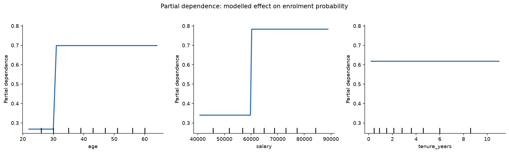
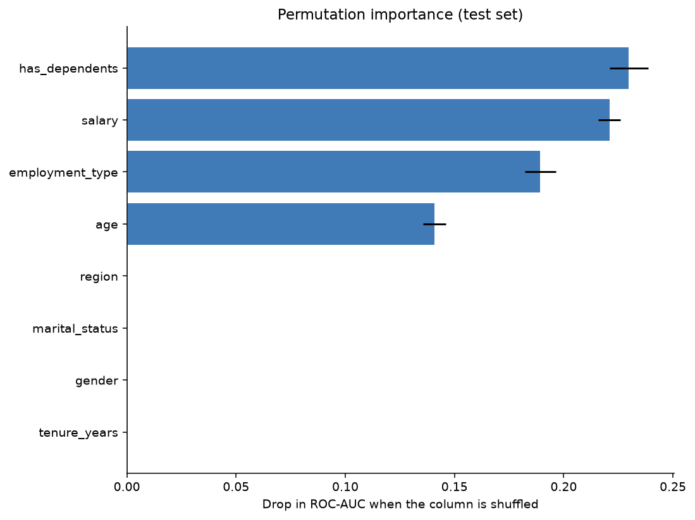
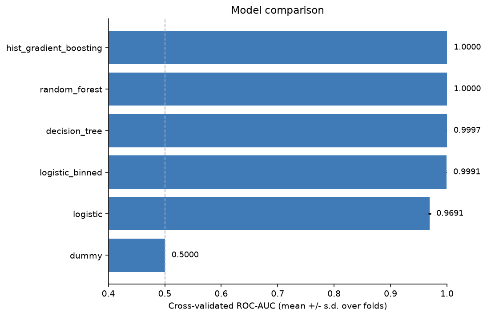
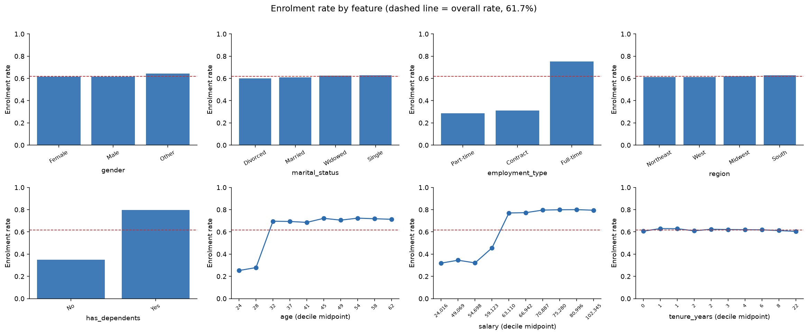
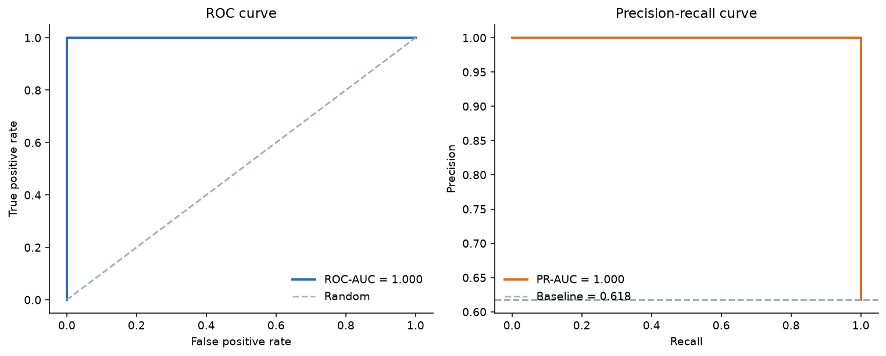
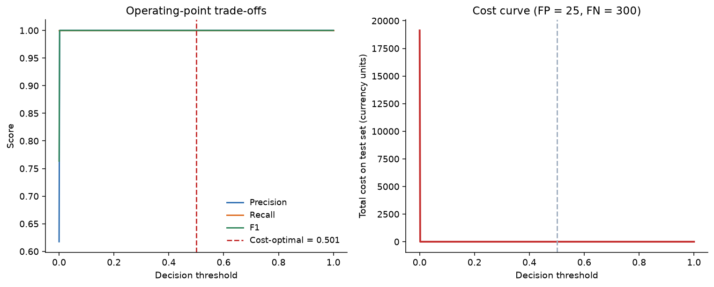

# Employee Insurance Enrollment Prediction

An end-to-end ML pipeline that predicts whether an employee will enroll in a voluntary insurance product, from census-style HR data.

> **Read this first.** The provided dataset's target turned out to be **fully deterministic** — `enrolled` is exactly *"at least 3 of {age > 30, salary > $60,000, employment_type == Full-time, has_dependents == Yes}"*, verified against all 10,000 rows with zero mismatches. The models therefore reach **1.000 ROC-AUC on held-out data**, which says something about the data generator rather than about the modelling. Detecting this is the most useful result in the project. Full analysis in **[report.md](report.md)**.

---

## The finding, in one picture

The model was never told about the rule. It found the breakpoints on its own — a step at **age 30**, a step at **$60,000**, and a perfectly flat line for `tenure_years`, which carries no signal at all:



Permutation importance says the same thing from the other direction. Four features carry the entire signal; the other four score **exactly zero** — their bars are invisible because there is nothing to draw:



That is the whole argument of this project on two charts: the target is a deterministic rule over four features, and half the dataset is noise by construction.

---

## Quickstart

```bash
make setup    # create .venv and install pinned dependencies
make train    # train, tune, evaluate, and write artifacts
make test     # run the test suite (76 tests)
```

Without `make`:

```bash
python3 -m venv .venv && .venv/bin/pip install -r requirements.txt
.venv/bin/python -m src.train
.venv/bin/python -m pytest tests/ -q
```

Requires Python 3.11+. Training takes ~90 seconds on a laptop.

### All commands

| Command | What it does |
|---|---|
| `make setup` | Create the virtualenv and install `requirements.txt` |
| `make eda` | Data-quality report, generating-rule discovery, EDA figures |
| `make train` | Tune 6 candidates, select, evaluate on held-out data, persist artifacts |
| `make test` | Run the test suite |
| `make serve` | Start the prediction API on `http://127.0.0.1:8000` |
| `make all` | `eda` → `train` → `test` |
| `make clean` | Remove generated artifacts and caches |

---

## What the pipeline does

1. **Load and validate** (`src/data.py`) — schema check, data-quality report, minimal cleaning. Problems are *reported*, not silently patched.
2. **Preprocess** (`src/features.py`) — imputation, encoding and scaling as pipeline steps, so they are refitted inside every CV fold and cannot leak.
3. **Train and tune** (`src/train.py`, `src/models.py`) — six candidates, `RandomizedSearchCV` over 5-fold stratified CV, scored on ROC-AUC.
4. **Select** — one-standard-error rule: the *simplest* model within one SE of the best score wins, so complexity is never bought with noise.
5. **Evaluate** (`src/evaluate.py`) — held-out metrics, calibration, cost-based threshold selection, permutation importance, partial dependence, per-subgroup slices.
6. **Serve** (`src/api.py`) — FastAPI service loading the persisted pipeline.

### Results summary

| | |
|---|---|
| Selected model | Decision tree (depth 4, entropy, balanced weights) |
| Test ROC-AUC / PR-AUC | 1.0000 / 1.0000 |
| Test accuracy | 1.0000 (vs 61.7% majority-class baseline) |
| Signal features | `has_dependents`, `salary`, `employment_type`, `age` |
| Zero-importance features | `gender`, `region`, `marital_status`, `tenure_years` |

Six candidates were tuned and compared under an identical protocol:



A depth-4 tree was chosen over a random forest that scored 1.0000: the 0.0003 AUC difference is far below what is worth paying for in interpretability and latency.

### What a training run looks like

```
$ make train

=== Cross-validated model comparison (training set) ===
                 model  cv_roc_auc_mean  cv_roc_auc_std  cv_roc_auc_se  fit_seconds  complexity_rank
         random_forest           1.0000          0.0000         0.0000         35.7                4
hist_gradient_boosting           1.0000          0.0000         0.0000         19.6                5
         decision_tree           0.9997          0.0003         0.0002          1.3                3
       logistic_binned           0.9991          0.0004         0.0002          1.7                2
              logistic           0.9691          0.0025         0.0011          1.5                1
                 dummy           0.5000          0.0000         0.0000          1.7                0

INFO  Selected 'decision_tree' over the top scorer 'random_forest':
      within 1 SE (0.9997 >= 0.9995) and simpler.

=== Held-out test performance ===
ROC-AUC 1.0000 | PR-AUC 1.0000 | Brier 0.0000
@ t=0.500  accuracy 1.0000  precision 1.0000  recall 1.0000

=== Permutation importance (test set) ===
        feature  importance_mean  importance_std
 has_dependents           0.2298          0.0088
         salary           0.2209          0.0051
employment_type           0.1892          0.0071
            age           0.1408          0.0052
         region           0.0000          0.0000
 marital_status           0.0000          0.0000
         gender           0.0000          0.0000
   tenure_years           0.0000          0.0000
```

The EDA run reports the finding that reframes everything:

```
$ make eda

WARNING  Target is a DETERMINISTIC function of the features
         (unconstrained tree: 100% train accuracy, depth 5, 13 leaves).
WARNING  Exact rule recovered -> at least 3 of 4:
         age > 30 | salary > 60000 | employment_type == 'Full-time' | has_dependents == 'Yes'
```

<details>
<summary><strong>More figures</strong> — enrollment rates, ROC/PR curves, calibration, threshold economics</summary>

Enrollment rate across every feature. The step changes in `age` and `salary` are visible here, as are the four features that sit flat on the overall rate:



ROC and precision-recall curves on the held-out set:



Threshold economics — the operating-point trade-off and the cost curve that selects the decision threshold:



</details>

---

## Prediction API

```bash
make serve   # then open http://127.0.0.1:8000/docs
```

| Endpoint | Purpose |
|---|---|
| `GET /health` | Liveness; reports whether a model is loaded |
| `GET /model/info` | Model card: what is deployed, and its known limitations |
| `POST /predict` | Score one employee |
| `POST /predict/batch` | Score up to 1,000 employees in one call |

Both prediction endpoints accept an optional `?threshold=` override.

```bash
curl -X POST http://127.0.0.1:8000/predict \
  -H "Content-Type: application/json" \
  -d '{"age": 41, "salary": 72500, "tenure_years": 6.5,
       "gender": "Female", "marital_status": "Married",
       "employment_type": "Full-time", "region": "West", "has_dependents": "Yes"}'
```

```json
{
  "enrollment_probability": 1.0,
  "will_enroll": true,
  "threshold": 0.501,
  "model_name": "decision_tree"
}
```

Live responses from a running service — an employee meeting all four conditions, one meeting none, and a rejected request:

```
GET  /health                         {"status":"ok","model_loaded":true,
                                      "model_name":"decision_tree",
                                      "trained_at":"2026-08-08T10:18:51"}

POST /predict   (41 / $72.5k /       {"enrollment_probability":1.0,
                 Full-time / deps)    "will_enroll":true, "threshold":0.501}

POST /predict   (25 / $30k /         {"enrollment_probability":0.0,
                 Part-time / none)    "will_enroll":false,"threshold":0.501}

POST /predict   employment_type      HTTP 422  — rejected before reaching
                = "Freelance"                    the model
```

`make serve` also exposes an interactive Swagger UI at `/docs`, where you can fill in an employee and run a prediction from the browser.

Input is validated by Pydantic, so malformed requests get a precise `422` rather than a `500`. If no model has been trained yet, the service still starts, reports `degraded` on `/health`, and returns `503` from the prediction endpoints.

---

## Project structure

```
├── README.md                 # this file
├── report.md                 # findings, model rationale, results, next steps
├── docs/design.md            # design decisions made before implementation
├── requirements.txt          # pinned dependencies
├── Makefile                  # every command in this README
├── pyproject.toml            # pytest and lint configuration
├── data/
│   └── employee_data.csv     # 10,000 employee records
├── src/
│   ├── config.py             # schema, paths, constants — single source of truth
│   ├── data.py               # loading, validation, cleaning, splitting
│   ├── features.py           # feature engineering + preprocessing pipelines
│   ├── models.py             # candidate registry and search spaces
│   ├── train.py              # CLI: tuning, selection, evaluation, persistence
│   ├── evaluate.py           # metrics, threshold economics, plots
│   ├── eda.py                # exploratory analysis + generating-rule discovery
│   └── api.py                # FastAPI prediction service
├── tests/                    # 76 tests
└── artifacts/
    ├── figures/              # all report figures
    ├── metrics/              # metrics.json, eda_summary.json, sweeps
    └── models/               # persisted pipeline (gitignored — rebuild with `make train`)
```

`artifacts/metrics/` and `artifacts/figures/` are tracked in git on purpose: they are the evidence behind `report.md` and should be reviewable in a diff. The `.joblib` binary is not tracked — it is reproducible from a seeded run.

---

## Training options

```bash
python -m src.train --help
```

| Flag | Purpose |
|---|---|
| `--models logistic decision_tree` | Train a subset of candidates |
| `--n-iter 60` | Randomised-search candidates per model (default 30) |
| `--cv 10` | Cross-validation folds (default 5) |
| `--seed 7` | Random seed (default 42) |
| `--no-feature-engineering` | Ablation: train on raw columns only |
| `--no-plots` | Skip figure generation |

Runs are deterministic given a seed.

---

## Testing

```bash
make test
```

```
$ make test
........................................................................ [ 94%]
....                                                                     [100%]
76 passed in 34.78s
```

76 tests covering the data contract and quality checks, feature engineering edge cases (unseen categories, missing values, division-by-zero on `tenure_ratio`), pipeline structure and leakage prevention, the model-selection rule, threshold economics, and every API endpoint including failure modes.

Verified end to end from a clean `git clone` — `make setup && make all` reproduces every figure and metric above, with an identical leaderboard to four decimal places.

---

## Notes and limitations

- **The dataset is synthetic and noiseless.** No threshold, coefficient or performance figure here transfers to real enrollment data. See [report.md §5](report.md) for what a production version would need.
- **The cost model is an assumption.** `COST_FALSE_POSITIVE = $25` and `COST_FALSE_NEGATIVE = $300` in `src/config.py` are stated placeholders that drive the recommended threshold. Replace them with measured campaign economics before relying on the operating point.
- **`gender` is used as a feature** because it was supplied. It carries zero measured importance here, and its use in insurance pricing or targeting would need legal review before any real deployment.
